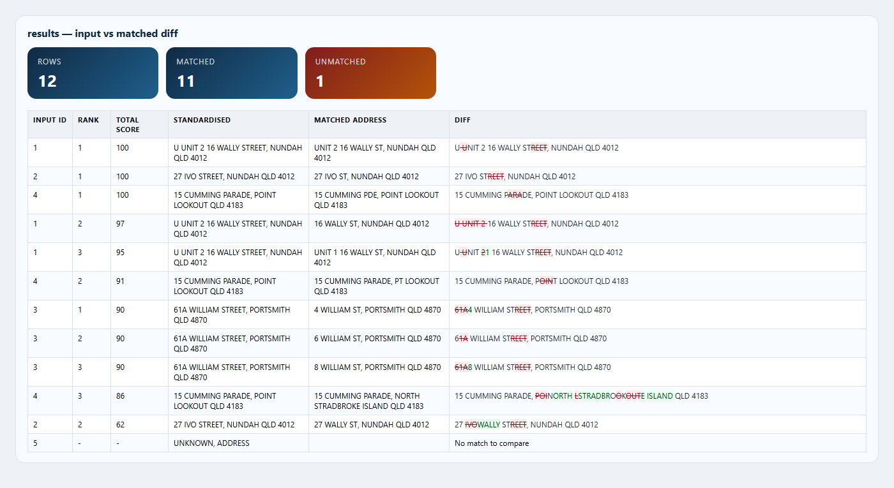
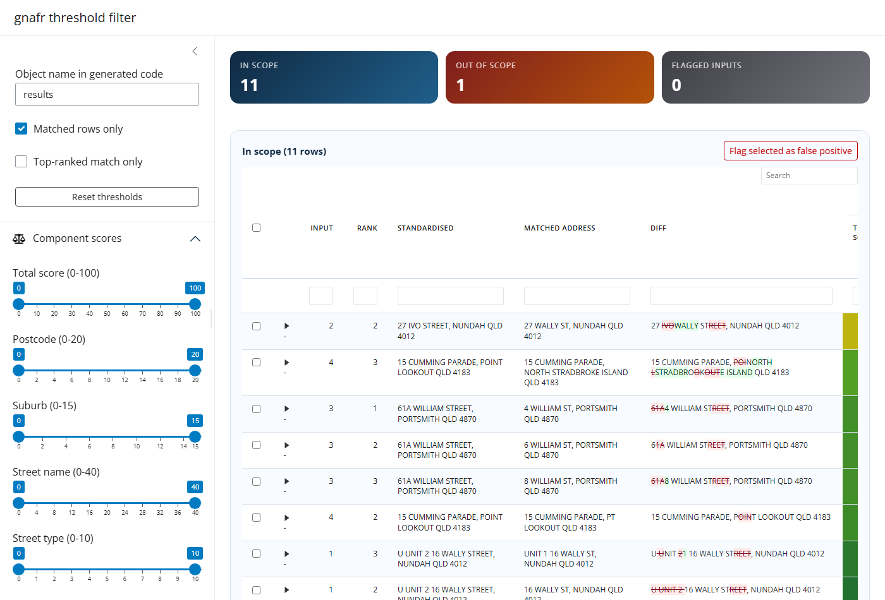

## 🏢 Six groups, a familiar problem

::: {.statement}
We keep encountering the same address — written **slightly differently**.
:::

::: {.columns}
::: {.column width="31%"}
::: {.card}
<div class="card-title">🔗 Reconcile</div>
Do these records refer to the same dwelling or site?
:::
:::
::: {.column width="31%"}
::: {.card}
<div class="card-title">🧹 Normalise</div>
Can we turn inconsistent text into a useful, consistent address?
:::
:::
::: {.column width="31%"}
::: {.card}
<div class="card-title">🗺️ Geocode</div>
Where is it — and which area does it belong to?
:::
:::
:::

**A shared workflow could save each team rebuilding the same pieces.**

::: {.notes}
- Allow about 35 to 40 minutes with the demos; the last two slides are backup detail.
- The audience does not need to know SQL or spatial R to follow the main story.
- Open gnafr-demo.R beside the presentation; its labelled R chunks follow the slide order. They are displayed but not run when rendering the deck.
- Press S for speaker notes and use the slide menu to skip optional detail.
- We have about six sub-groups, and several teams run into versions of this problem.
- Some need to connect records to a particular dwelling. Others need a useful location for reporting.
- The source systems, address quality and consequences of an incorrect match vary.
- The aim is to share the preparation, matching and review work while keeping those choices visible.
:::

## 🎚️ One package, different acceptance rules

<div class="spectrum">
  <div><strong>Higher precision</strong><br><span>The exact dwelling matters</span></div>
  <div class="spectrum-line"></div>
  <div><strong>Broader coverage</strong><br><span>More candidates to assess</span></div>
</div>

| If the job is… | We might care most about… |
|---|---|
| Linking individual records | Unit, house number and competing candidates |
| Cleaning an address register | A consistent label and a stable address identifier |
| Assigning a reporting area | A defensible coordinate and the right geography |

::: {.output-strip}
Choose what to search → inspect the evidence → define what to accept
:::

::: {.notes}
- Precision means accepted matches are correct; coverage here means how much of the input we can use.
- Raising a threshold usually gives fewer accepted rows. It does not prove the remaining rows are correct.
- A reporting area still needs a defensible location: a wrong point can cross an SA2 boundary.
- gnafr provides weights, candidate filters, fallback settings and linked-address options.
- Each team should try those controls against examples with known answers.
:::

## 🧪 In development, with substantial AI assistance

::: {.columns}
::: {.column width="48%"}
### How it has been built

- Heavily built with **Anthropic / generative AI**
- Faster iteration on R, SQL, interfaces and tests
- More time to try difficult address cases
:::
::: {.column width="48%"}
### What gives us evidence

- Review the implementation and returned records
- Turn reported failures into **testthat regression tests**
- Check known matches and known non-matches
:::
:::

::: {.callout-note appearance="simple"}
Passing tests protects behaviour we have checked. Real labelled addresses tell us how well it works for a team.
:::

::: {.notes}
- Be upfront that a substantial amount of this package has been built with Anthropic and generative AI.
- The benefit has been getting working implementations and experiments together quickly.
- AI can also produce plausible code, explanations and tests that share the same wrong assumption.
- A regression test records an expected outcome for a case that previously failed, then checks future changes against it.
- Existing tests cover parsing, scoring, aliases, principal and primary links, missing inputs, caching and geographies.
- For example, the parser tests check that ST JAMES becomes SAINT JAMES while ST LUCIA stays ST LUCIA.
- From the repository, testthat::test_local(filter = "parse") runs that part of the suite.
- Passing those tests is different from measuring precision on our office data. We still need examples with independently checked answers.
- The matching workflow itself runs R and DuckDB; it does not send addresses to a language model.
:::

## ▶️ R stop 1: start the database build {#start-build}

```{r}
#| label: demo-setup
library(gnafr)
library(data.table)

gnaf_dir <- Sys.getenv("GNAF_STANDARD_DIR", "C:/data/G-NAF/Standard")
db_path <- Sys.getenv("GNAF_DEMO_DB",
                      file.path(tempdir(), "gnafr-r-user-group.duckdb"))
con <- gnaf_connect(db_path, memory_limit = "4GB", threads = 4L)
```

```{r}
#| label: demo-build
system.time(gnaf_build_db(con, gnaf_dir, states = "QLD"))
```

**Let R run; switch back to the slides.** 🦆

::: {.notes}
- Download and extract G-NAF Standard before the meeting. The build takes an existing local folder, not a download URL.
- Run these chunks in one R session, then switch back to the browser while R is busy.
- My build has taken about three minutes. That is an observed local time, not a promise for every machine or national extract.
- QLD keeps this demonstration bounded. Use states = "all" for every state present in the download.
- The default demo path is in the R session's temporary folder, so it is separate from a working database. A permanent path keeps the file across sessions.
- If GNAF_DEMO_DB points to the prepared backup, skip demo-build and carry on with that connection.
- The memory and thread settings are examples for the meeting machine, not universal recommendations.
- Standard provides locality, street and address alias information. The flattened Core CSV can also be loaded, but is a different preparation route.
- G-NAF comes from data.gov.au; retain the attribution and licence information supplied with the extract.
:::

## 🦆 DuckDB: a database inside the R process

::: {.columns}
::: {.column width="54%"}
::: {.big-number}
one file
:::

- No separate database server to administer
- Build once; reopen in another R session
- Columnar storage suits scans and bulk analysis
- R uses the familiar **DBI** connection interface
:::
::: {.column width="42%"}
```{mermaid}
%%| eval: true
%%| echo: false
%%| fig-height: 4.1
%%{init: {'flowchart': {'htmlLabels': false}}}%%
flowchart TB
  R["R session"] --> D["DuckDB engine"]
  D <--> F[("gnafr.duckdb")]
  D --> T["Selected results in R"]
  style D fill:#e3f2ef,stroke:#21705b,stroke-width:2px
  style F fill:#e9f2fa,stroke:#236188,stroke-width:2px
```
:::
:::

<p class="source">Sources: <a href="https://duckdb.org/docs/current/clients/r">DuckDB R client</a>; <a href="https://duckdb.org/why_duckdb">Why DuckDB</a>.</p>

::: {.notes}
- Embedded means the database engine runs inside the R process. There is no separate service to start or request from IT.
- The file stores the reference tables persistently; con is the R connection used to query them.
- Columnar storage groups values by column, which suits reading selected fields across many rows.
- This is useful for a large, mostly read-heavy reference dataset and repeated batches of input addresses.
- It also means we can inspect the database directly with SQL when investigating a result.
- DuckDB is a transferable part of this talk: the same idea can help with other large reference datasets in R.
:::

## ⚙️ Keep the large joins close to the data

```{mermaid}
%%| eval: true
%%| echo: false
%%| fig-height: 4.2
%%| fig-width: 13
%%{init: {'flowchart': {'htmlLabels': false}}}%%
flowchart LR
  P["G-NAF PSV files"] -->|read and join in SQL| D[("Reference tables")]
  R["R: parse the input batch"] --> I["Register parsed rows"]
  subgraph SQL["DuckDB: work on the batch"]
    I --> C["Find candidates"] --> S["Score components"] --> K["Rank per input"]
    D --> C
  end
  K --> O["R: data.table of results"]
  style SQL fill:#f0f6fa,stroke:#236188
  style O fill:#e3f2ef,stroke:#21705b,stroke-width:2px
```

- The build reads and joins G-NAF files inside DuckDB
- Matching scores candidate pairs in SQL, then returns the leading candidates
- The full national address table does **not** become an R object

::: {.notes}
- A naive approach would compare every input string with every reference address. That quickly becomes an enormous number of pairs.
- gnafr registers a parsed batch so SQL can join it with selected reference rows.
- Postcodes and numbers reduce the comparisons before the more expensive text similarity work.
- DuckDB evaluates score expressions and ranks candidates within each input.
- R receives the candidate results and assembles the final table, including unmatched input rows.
- During a build, the package also creates indexes, the locality lookup and number-free street records.
- SQL performance comes from the whole query plan, data layout and smaller candidate set. An index is not a guarantee that every join will use it.
- Saved-geography preparation is a separate case: distinct coordinates enter R for the sf lookup, then their attributes are stored back in DuckDB.
:::

## 🔁 Reuse the file, plan the writes

| Design choice | Practical benefit |
|---|---|
| Keep one connection open | Reuse the same reference data across batches |
| Exact lookup and eligible match cache | Avoid repeating some expensive matching work |
| Set memory, threads and spill directory | Fit the workload to the machine |
| Prepare a versioned reference file | Give teams the same starting data |

::: {.callout-tip appearance="simple"}
Build and refresh first. Close the writer before sharing a file for concurrent read-only use.
:::

<p class="source">Sources: <a href="https://duckdb.org/docs/current/connect/concurrency">DuckDB concurrency</a>; <a href="https://duckdb.org/docs/current/guides/performance/how_to_tune_workloads">Tuning workloads</a>.</p>

::: {.notes}
- A single R process can write to a local DuckDB file. Multiple processes can open it read-only when there is no writer.
- For a shared read-only run, use gnaf_connect(path, read_only = TRUE) and gnaf_match(x, con, cache = FALSE).
- Matching with caching can write results, so explicitly disable it on that read-only connection.
- Close and release the connection with gnaf_disconnect(con) before switching access mode or handing over the completed file.
- The match cache requires the default weights, normalisation, candidate filters and fallback settings, with max_results = 1. Other settings bypass it.
- New cache entries normally require at least 95 points. The cache is a speed feature, not independent validation.
- DuckDB supports many larger-than-memory operations by spilling to disk. It still needs RAM and enough temporary disk space; memory_limit is not a cap on the entire R process.
- Include the G-NAF release and package version when naming or documenting a shared file.
:::

## 🧭 What does `gnaf_match()` do? {#matching-overview}

```{mermaid}
%%| eval: true
%%| echo: false
%%| fig-height: 4.8
%%| fig-width: 13
%%{init: {'themeVariables': {'fontSize': '20px'}, 'flowchart': {'htmlLabels': false, 'curve': 'basis', 'rankSpacing': 25, 'nodeSpacing': 25}}}%%
flowchart TB
  subgraph PREP["Prepare + retrieve"]
    direction LR
    A["Address<br/>vector"] --> B["1 · Parse<br/>standardise"]
    B --> C["2 · Look up /<br/>retrieve candidates"]
    D[("DuckDB<br/>reference rows")] --> C
  end
  subgraph MATCH["Score + return"]
    direction LR
    E["3 · Score<br/>six components"] --> F["4 · Rank<br/>candidates"]
    E -.->|weak or unmatched| G["Broaden search<br/>locality / number<br/>optional street-only"]
    G -.->|re-score| E
    F --> H["5 · Resolve links<br/>join geographies"]
    H --> I["Scored<br/>data.table"]
  end
  PREP --> MATCH
  style PREP fill:#f4f8fb,stroke:#b4cbdc
  style MATCH fill:#f4f9f7,stroke:#b9d7cc
  style B fill:#e9f2fa,stroke:#236188
  style C fill:#e9f2fa,stroke:#236188
  style E fill:#e3f2ef,stroke:#21705b
  style F fill:#e3f2ef,stroke:#21705b
  style G fill:#fff1db,stroke:#b77526
  style I fill:#12405c,color:#fff,stroke:#12405c
```

::: {.output-strip}
Raw input + standardised input + matched label + PID + coordinates + component scores
:::

::: {.notes}
- Read this as a guided search, followed by an explicit decision about which record to return.
- The fast paths can finish some inputs before the broader candidate searches.
- Exact labels still get component scores; exact text is not blindly assigned 100.
- The fallback arrow summarises a fixed sequence of searches, not an endless loop.
- Locality fallback needs weak locality evidence or no match; number fallback needs weak number evidence or no match. Merely having a lower total does not trigger every path.
- After collecting candidates, the function applies min_score and max_results and keeps deterministic ranks.
- Principal and primary resolution happens after scoring and ranking. Geography attributes use the final returned address.
- Unmatched inputs stay in the table. With max_results above one, an input can have several rows.
:::

## 🧩 First, separate the address components

```{r}
#| label: demo-parse-one
address_parse("U 2 16 wally st, nundah qld 4012")
```

| Evidence in the text | Parsed value |
|---|---|
| `U 2` | Flat type `UNIT`, flat number `2` |
| `16` | Street number `16` |
| `wally st` | Street name `WALLY`, type `STREET` |
| `nundah` | Locality `NUNDAH` |
| `qld 4012` | State `QLD`, postcode `4012` |

**Keep the unit, number and locality. Commas can help separate street and suburb.**

::: {.notes}
- address_parse works without a database and returns one row per input.
- Case, repeated spaces and common punctuation are handled before the structural fields are extracted.
- Comma boundaries help distinguish a street from a locality containing words such as HILL, PARK or POINT.
- Numbers, ranges, units, levels, lots, directions and building names have separate fields.
- The parser handles repeated structural inputs once, then restores the original row order and raw strings.
- The later gnaf_match result contains both input_raw and input_standardised.
- Keep source evidence, but remove unrelated customer IDs or free-text notes before matching.
:::

## 🏔️ Mountains, ordinals… and saints

| Written as… | Current standardisation |
|---|---|
| `Rd`, `Ct`, `Ave`; `U`, `Apt`; `Lvl` | Canonical street, flat and level types |
| `MT` / `MNT` in a street or locality | `MOUNT` |
| `CK`, `NTH`, `STH`; leading `N`, `S`, `E`, `W` | `CREEK`, `NORTH`, `SOUTH`; compass words |
| `1ST` … `20TH` in a street name | `FIRST` … `TWENTIETH` |
| `ST JAMES CT` | Street name `SAINT JAMES`, type `COURT` |
| Locality `ST LUCIA` | Stays **`ST LUCIA`** |

::: {.output-strip}
“St” depends on its role: street type, street name, or locality
:::

::: {.notes}
- Yes, it handles saints, but context matters.
- The street type is extracted first. ST in the remaining street name can then expand to SAINT.
- ST stays literal in locality names to follow the G-NAF convention, including ST LUCIA.
- MT and MNT expand to MOUNT. The word MOUNTAIN is already a word and remains unchanged.
- Ordinal expansion currently covers first through twentieth in street names. Do not imply unlimited number-word conversion.
- A spaced ampersand in the street name or locality becomes AND.
- normalize = FALSE disables these name expansions; structural parsing and basic cleaning still happen.
- These are implemented rules with tested cases, not a claim to understand every possible Australian address.
:::

## 🔎 R stop 2: try the awkward structures

```{r}
#| label: demo-parse-cases
parse_examples <- c(
  "10 St James Ct, St Lucia QLD 4067",
  "5 Mt Gravatt Rd, Mt Gravatt QLD 4122",
  "5 1st Ave, Broadbeach QLD 4218",
  "Shop 14 Level 3 52 Davenport Rd, South Brisbane QLD 4101",
  "Lot 7 Kreis Rd, Westbrook QLD 4350",
  "Unti 2 16 Wally St, Nundah QLD 4012"
)
parsed <- address_parse(parse_examples)
parsed[, .(in_flat_number, in_level_number, in_lot_number,
           in_number_first, in_street_name, in_locality)]
```

Also handles **`2/16` units**, **`12-14` ranges**, **`61A` suffixes** and building prefixes.

::: {.notes}
- Return to the same R session once the build has finished and run the parser chunks.
- The shop, level and house number are independent pieces of evidence.
- A lot number stays a lot number; it is not silently turned into a street number.
- Unti is an example of a restricted repair for a misspelt unit marker when two identifiers follow it.
- That repair uses edit distance or an adjacent transposition and rejects ambiguous corrections. It is not general spell-checking of address text.
- Other tests cover building prefixes, letter suffixes, ranges, type-less street names such as THE AVENUE, and typos in street types.
- The parser alone has no G-NAF locality lookup. gnaf_match can recover some missing localities using the database when locality fallback is enabled.
:::

## 🔍 Retrieve plausible candidates, then broaden

| Search stage | What it does |
|---|---|
| Postcode, or state if postcode is absent | Narrows the location; blocks by number, range or lot |
| Locality fallback — on by default | Uses a similar locality to find candidate postcodes |
| Street-number fallback — on by default | Relaxes the number restriction and searches by street |
| Street-only fallback — off by default | Tries number-free street records for remaining unmatched inputs |

::: {.callout-important appearance="simple"}
A correct record excluded from the candidate set cannot be rescued by a better score.
:::

::: {.notes}
- Postcode and number are both evidence and a way to keep the search small.
- If a postcode cannot be parsed, a state can support the broader first search.
- With no usable location information, the package may have too little evidence to find a candidate.
- Locality fallback searches the locality index with Jaro-Winkler similarity, then uses the candidate postcodes for another address search.
- The default fallback_threshold is 90; the relevant component must also be weak, unless there is no result.
- Street-number fallback can return an address at a different number, with a low number score. It does not repair or validate the input number.
- A street-score upper bound drops pairs that cannot possibly reach min_score, taking the requested weights into account.
- Better structured inputs usually mean fewer comparisons. A build finishing in minutes does not imply every damaged batch will match that quickly.
:::

## ⚖️ Six components add up to 100

::: {.columns}
::: {.column width="45%"}
| Component | Default weight |
|---|---:|
| Street name | 40 |
| Postcode | 20 |
| Suburb / locality | 15 |
| Street type / direction | 10 |
| Number / range / lot | 10 |
| Flat / level | 5 |
:::
::: {.column width="51%"}
::: {.card}
<div class="card-title">An illustrative 91 points</div>

20 postcode + 15 suburb + **36 street name** + 10 street type + 10 number + **0 flat**

Strong overall agreement can still hide a **conflicting unit**.
:::

`total_score` measures agreement.

**91 points does not mean 91% likely to be correct.**
:::
:::

::: {.notes}
- Each component earns an integer number of points and the six values are added.
- The example is illustrative arithmetic, not a captured result row.
- Street and locality names receive fuzzy text credit. Other components use specific agreement, missing-evidence and conflict rules.
- State is used in candidate retrieval; it is not a seventh weighted score. Building name is parsed but has no separate weight.
- Missing fields are not all treated alike, and the available weights are not rescaled to ignore missing evidence.
- The flat component can earn full credit when neither side has a flat or level. This means absence is not treated as a conflict there.
- Read number and flat scores when the dwelling matters. One overall threshold cannot express every use case.
- Custom weights must supply all six components and sum to 100. Detailed number, type and flat rules are on the backup slide.
:::

## 📏 How fuzzy name credit works

**Jaro–Winkler** compares the street name and locality separately.

| Name agreement | Credit from a 40-point street-name weight |
|---|---:|
| Exact same text | 40 |
| Jaro–Winkler similarity 0.90 | 23 |
| Similarity 0.80 | 12 |
| Similarity 0.60 or below, both names present | 2 |
| Either name missing | 0 |

**Close spellings earn more credit; shared letters alone earn little.**

::: {.notes}
- Jaro compares matching characters and their order; the Winkler adjustment gives additional credit for a shared prefix.
- gnafr uses a prefix scaling value of 0.1 in the R comparison, with DuckDB's built-in function in SQL.
- Raw similarities for unrelated names can still be around 0.5 or 0.6. The package therefore reshapes that value before awarding points.
- Subtract 0.60, divide by 0.40, and limit the result to zero through one. Square it, multiply by 0.95, then add 0.05.
- Multiply that factor by the component weight and round to an integer, using ties-to-even rounding.
- For 0.90, the factor is 0.584375, so a 40-point weight gives 23 points after rounding.
- Exact text receives the full weight. A non-exact name is capped at one point below the rounded weight, even if the similarity is extremely close to one.
- The same shape applies to locality, using its 15-point weight. Either missing name receives zero.
- These are current implementation choices to evaluate with real labelled cases, not a universal statistical model.
:::

## 🔤 Jaro–Winkler, Jaccard and Levenshtein

`gnaf_text_scores(results)` adds **whole-address diagnostics**, each on a 0–100 scale.

| Metric | What it compares |
|---|---|
| Jaro–Winkler | Character agreement, order and a shared prefix |
| Jaccard | Overlap of **character bigrams** — pairs of adjacent characters |
| Levenshtein | Insertions, deletions and substitutions needed to change one string into the other |
| `text_similarity` | Mean of Jaro–Winkler and Jaccard scores |

These help with review. **They do not contribute extra points to `total_score`.**

::: {.notes}
- Component scoring and whole-address text scoring answer different questions.
- The whole-string function compares the cleaned raw input with the matched label. It does not compare a fully re-parsed standardised label on each side.
- Jaccard here uses character bigrams, not address words. The score is the intersection size divided by the union size, multiplied by 100.
- Levenshtein similarity is one minus edit distance divided by the longer string length, multiplied by 100.
- The combined text_similarity averages the rounded Jaro-Winkler and Jaccard scores. Levenshtein is displayed separately and is not included in that average.
- A long address can have high whole-string similarity while differing in a critical unit number.
- When principal or primary output replaces the label, these diagnostics use matched_address_label so they still describe the original candidate.
- Unmatched rows receive missing text scores. The function returns a copy of the input table.
:::

## ▶️ R stop 3: match and inspect {#run-matching}

```{r}
#| label: demo-match
gnaf_status(con)
addresses <- c(
  "U 2 16 wally st, nundah qld 4012",
  "27 Ivo Stret, Nundah QLD 4012",
  "61A William Street, Portsmith QLD 4870",
  "15 Cumming Pde, Point Lookout QLD 4183",
  "Unknown address"
)
results <- gnaf_match(addresses, con, max_results = 3L,
                      min_score = 60L, cache = FALSE)
results[, .(input_id, address_label, matched, match_rank,
            total_score, score_number, score_flat, alias_type)]
```

**Look at alternatives and component scores before accepting a row.**

::: {.notes}
- Start by checking the completed build's counts. The build time shown by system.time belongs to this run.
- These are demonstration inputs, not a labelled accuracy benchmark. Exact results depend on the loaded release and alias coverage.
- The spelling and formatting examples show why parsing and matching both matter.
- Inspect the William Street number and suffix in particular. A high score can still describe a different numbered address.
- Unknown address shows that unmatched inputs remain present.
- max_results = 3 asks for up to three candidates per input. min_score = 60 keeps the review fairly broad; it is also the package default, not a production acceptance recommendation.
- Later chunks use this results object. Keep the same R session and connection open.
:::

## 🎛️ Tune the search and the decision separately

| Control | What changes |
|---|---|
| `include_aliases`, `alias_types`, `include_custom` | Which reference records compete |
| `locality_fallback`, `street_number_fallback`, `street_only_fallback` | How far the search can broaden |
| `weights` | How evidence contributes to ranking |
| `min_score`, `max_results` | Which candidates are returned for review |
| A `data.table` filter after matching | Which returned candidates the team accepts |

::: {.callout-tip appearance="simple"}
Retrieve broadly enough to study the errors. Then apply a rule that reflects the team's task.
:::

::: {.notes}
- max_results changes the number of alternatives, not the required precision of a match.
- min_score filters candidate results during matching; a later filter cannot recover discarded rows.
- A higher number or flat weight may make sense when a dwelling is important, but it reduces weight available elsewhere.
- For example, weights = list(postcode = 15, suburb = 10, street_name = 35, street_type = 10, number = 20, flat = 10) sums to 100. It is an illustration, not a validated policy.
- Disable street_number_fallback if returning a different numbered address is not useful to the task, and still check the number score.
- Keep a labelled review sample that includes false positives and unmatched rows, not only successful matches.
:::

## 🪪 Aliases expand the names we can recognise

| Reference record | Why it can help |
|---|---|
| Core row — `alias_type = NA` | The base address record |
| `LOCALITY:…` | A recognised alternative locality name or postcode |
| `STREET:…` | A recognised alternative street name |
| `ADDRESS:…` | An address alias linked to a principal record |
| `street_only` | A generated, number-free street record |

```{r}
#| label: demo-alias-control
core_only <- gnaf_match(addresses, con, include_aliases = FALSE)
```

::: {.notes}
- By default all available alias types compete with core addresses before ranking.
- Recognised aliases come from the loaded reference data; fuzzy spelling does not create a new official alias.
- G-NAF Standard lets the build create locality and street variants as well as loading address-alias relationships.
- include_aliases = FALSE excludes every alias type, including street-only rows. It is equivalent to alias_types = NA.
- For finer control, use a vector such as alias_types = c(NA, "STREET:SYN"). NA includes core rows; inspect the types actually loaded before choosing.
- Do not combine include_aliases = FALSE with an explicit alias_types value; the function rejects that combination.
- These settings apply to custom rows too, but include_custom remains a separate switch.
:::

## 🏘️ Matched spelling → principal → primary

```{mermaid}
%%| eval: true
%%| echo: false
%%| fig-height: 2.7
%%{init: {'flowchart': {'htmlLabels': false}}}%%
flowchart LR
  A["Matched alias<br/>UNIT 2 10 OLD STREET"] -->|principal_pid| B["Principal address<br/>UNIT 2 20 NEW ROAD"]
  B -->|primary_pid| C["Primary address<br/>20 NEW ROAD"]
  style A fill:#fff1db,stroke:#b77526
  style B fill:#e3f2ef,stroke:#21705b
  style C fill:#e9f2fa,stroke:#236188
```

| Option | Returned address information |
|---|---|
| Default | The candidate that matched |
| `resolve_principal = TRUE` | Also append `principal_*` fields |
| `return_principal = TRUE` | Replace address fields with the linked principal |
| Also `return_primary = TRUE` | Then replace them with the linked primary |

<p class="source">Illustrative linked records; links must exist in the loaded data.</p>

::: {.notes}
- Principal identifies the canonical address behind an alias; primary identifies the parent of a secondary address such as a unit.
- Those are different relationships. Removing an alias and aggregating units to a site are different decisions.
- The labels in this diagram are illustrative, based on the package's linked-record test cases.
- return_principal changes the PID, label, components and coordinates together. return_primary does the same for the primary record.
- With both enabled, principal resolution comes first, then primary resolution.
- Scores and ranks still describe the original candidate. The matched_* columns preserve its address fields whenever a return option is enabled.
- Missing links leave the matched record unchanged. Several candidates resolving to one PID keep their separate rows and ranks.
- Choose the entity before joining geographies or aggregating records.
:::

## 📌 Which coordinate are we returning?

| Result choice | Location meaning |
|---|---|
| Matched address | Coordinates stored on that candidate |
| Returned principal or primary | Coordinates stored on the linked record |
| Relaxed street-number match | A candidate at another number may supply the point |
| `street_only` result | **No coordinates** in the current generated records |

```{r}
#| label: demo-linked-return
resolved <- gnaf_match(addresses, con, return_principal = TRUE,
                       return_primary = TRUE, cache = FALSE)
resolved[, .(matched_address_label, address_label,
             longitude, latitude, geocode_type, score_number)]
```

::: {.notes}
- The package returns coordinates from the reference records; it is not estimating a new point from the address text.
- The Standard loader uses ADDRESS_DEFAULT_GEOCODE and retains its geocode_type. There is no gnaf_match parameter to select among every geocode type.
- Core inputs or older databases may not contain all the relationship and geocode metadata shown here.
- Changing to the principal or primary can move the coordinate. This may also change the reporting area attached later.
- A number-relaxed match may be useful for investigating a street, but the returned point is still that candidate's address, not the requested house.
- Generated street-only records currently have missing longitude and latitude. Enabling that path does not produce a street centroid.
- Match score measures address agreement, not positional accuracy, and matched = TRUE does not guarantee a usable coordinate.
:::

## 👀 R stop 4a: a portable HTML diff {#static-review}

::: {.columns}
::: {.column width="49%"}
```{r}
#| label: demo-static-review
review_file <- file.path(
  tempdir(), "gnafr-review.html"
)
gnaf_threshold_filter(
  results,
  html = review_file,
  launch.browser = TRUE
)
```

- Compare standardised input with the matched label
- One self-contained HTML file
- Every result row; no Shiny session
:::
::: {.column width="47%"}
[{.review-preview}](assets/threshold-static.png)
:::
:::

::: {.notes}
- Run the chunk and show the coloured character differences in the browser.
- html = TRUE is a shorter alternative that writes to a temporary file and opens it in an interactive R session.
- A file path gives us a named artefact we can reopen later.
- The static mode is a diff table. It does not have the Shiny threshold sliders or generate an acceptance rule.
- It renders every supplied row rather than applying the interactive max_rows display cap. File and browser size still grow with the data.
- The embedded preview was generated from the package using a small demonstration result. The live output depends on the loaded database.
:::

## 🎚️ R stop 4b: review interactively with Shiny

::: {.columns}
::: {.column width="43%"}
```{r}
#| label: demo-shiny-review
review <- gnaf_threshold_filter(
  results,
  html = FALSE,
  max_rows = 30L
)
```

- Move component and text-score ranges
- See rows move in or out of scope
- Flag known false positives
- **Done** prints the filter as R code
:::
::: {.column width="53%"}
[{.review-preview}](assets/threshold-shiny.png)
:::
:::

::: {.notes}
- html = FALSE is the default and launches the interactive Shiny app. It still displays in a browser.
- Demonstrate total score first, then number or flat score so the audience sees why the components matter.
- Compare raw input, standardised input and the matched label using the app's comparison controls.
- Turn on top-ranked match only if that is the population we intend to accept.
- Flagging an input excludes every candidate with that input_id, not just the displayed rank.
- max_rows limits the displayed diff rows in each table. The scope counts and generated filter still apply to every row in results.
- For a large run, text_scores = FALSE skips whole-string diagnostics if component scores are enough for the review.
- Press Done before running the next R chunk. The app blocks the R console while it is open.
- gnaf_app(con) is another interface for entering and matching addresses interactively; this demo focuses on reviewing an existing batch.
:::

## 📝 Turn the review into a repeatable rule

```{r}
#| label: demo-acceptance-rule
# Illustrative rule: replace with the rule agreed from labelled examples.
accepted <- results[
  matched == TRUE & match_rank == 1L &
  total_score >= 90L & score_number == 10L & score_flat == 5L
]

source_rows <- data.table(input_id = seq_along(addresses),
                          original_address = addresses)
final <- accepted[source_rows, on = "input_id"]
```

**Keep the full candidate table, the chosen rule and the reference-data version.**

::: {.notes}
- The app returns generated code in review$code$data.table$in_scope. Copy that code into the working script.
- This displayed rule is an illustration using default component weights; it is not the outcome of our live review or a recommended office-wide threshold.
- score_number = 10 asks for full number credit with default weights. score_flat = 5 can also mean neither record has a flat or level.
- If the task requires an explicitly known unit, inspect the parsed unit and reference fields as well.
- When a text-score threshold is used, the app's generated code calls gnaf_text_scores so the extra columns exist.
- Join back using input_id rather than the address text, because repeated input strings may belong to different source records.
- This join retains every source row, including records we did not accept. Keep results separately for audit and later re-review.
:::

## ➕ Add addresses your team knows about

```{r}
#| label: demo-custom-address
office_sites <- data.table(
  address_detail_pid = "DEMO_SITE_001",
  number_first = 42L, street_name = "EXAMPLE", street_type = "ROAD",
  locality_name = "BRISBANE", state = "QLD", postcode = 4000L
)
gnaf_add(con, office_sites)
custom_result <- gnaf_match("42 Example Rd, Brisbane QLD 4000", con)
custom_result[, .(address_label, source, total_score, longitude, latitude)]
```

- Operational sites or internal records join the same candidate search
- Returned as **`source = "custom"`**; included by default
- Coordinates are optional — supply known coordinates when available

::: {.notes}
- This is a deliberately fictional record for the demonstration, added to the separate demo database.
- gnaf_add needs the six structured fields shown here. A PID is optional, but an explicit stable ID makes repeat loads easier to manage.
- The function normalises structured text and known street types; it does not take a raw character vector like gnaf_match.
- Coordinates, flat and level fields, building information and links can also be supplied.
- No coordinates are invented when they are absent, as this example shows.
- Custom rows compete with G-NAF rows using the same scoring. include_custom = FALSE switches them off.
- Duplicate supplied PIDs are skipped by default. upsert = TRUE replaces the stored row for that PID when an update is intended.
- A team could maintain an additional reference source without changing the matching API.
:::

## 🗺️ Extend the database with SA2 geographies

```{mermaid}
%%| eval: true
%%| echo: false
%%| fig-height: 3.8
%%| fig-width: 13
%%{init: {'flowchart': {'htmlLabels': false}}}%%
flowchart LR
  A[("Address coordinates")] --> B["Distinct coordinate pairs"]
  P["SA2 polygons + attributes"] --> C["sf point-in-polygon<br/>lookup in R"]
  B --> C
  C --> D[("Saved PID → SA2 table<br/>inside DuckDB")]
  M["Final returned address PID"] --> J["Join saved attributes"]
  D --> J --> R["Match result<br/>+ SA2 code / name"]
  style C fill:#e3f2ef,stroke:#21705b
  style D fill:#e9f2fa,stroke:#236188
```

**Do the spatial work once. Reuse a regular table join on later matching runs.**

::: {.notes}
- An SA2 is an ABS Statistical Area Level 2. Here it is an example of attaching polygon attributes to address points.
- The same mechanism can attach LGA names, service regions or a team's own boundaries.
- The package selects distinct coordinate pairs in DuckDB, performs the spatial lookup in R with sf, then stores the attributes by address PID.
- This preparation step does bring distinct coordinates into R, and currently processes them together. It can take more memory and time than a small matching demo.
- The saved table is a snapshot. Refresh it after new address data, coordinate changes or new boundaries.
- Missing coordinates or an unmatched polygon leave missing attributes; the function does not silently choose the nearest area.
- Final geography joins respect the returned PID and source after principal or primary resolution, without changing score or rank.
:::

## ▶️ R stop 5: register SA2, then request it

```{r}
#| label: demo-add-sa2
sa2_file <- system.file("extdata", "SA2", "SA2_2021_AUST_GDA2020.shp",
                         package = "gnafr")
sa2 <- sf::st_read(sa2_file, quiet = TRUE)
gnaf_add_geography(con, "sa2_2021", sa2,
  return_cols = c(sa2_code = "SA2_CODE21", sa2_name = "SA2_NAME21"),
  points_crs = 7844
)
```

```{r}
#| label: demo-use-sa2
gnaf_list_geographies(con)
with_sa2 <- gnaf_match(addresses, con, return_principal = TRUE,
                       geographies = "sa2_2021")
with_sa2[, .(input_id, address_label, sa2_code, sa2_name)]
```

::: {.notes}
- The repository includes this SA2 2021 boundary file. If it is absent from an installed build, set sa2_file to the local boundary download.
- points_crs describes the stored address coordinates, not the polygon file. This example assumes the G-NAF source coordinates are GDA2020, so it uses EPSG 7844.
- Confirm the datum of the extract before the meeting. Use 4283 for GDA94 or 4326 for WGS84 coordinates; the shapes carry their own CRS.
- The function transforms points as needed to work with the polygons. Do not relabel a CRS as a substitute for transforming coordinates.
- Registration requires a writable connection and a new geography name. If using the prepared database and the layer already exists, skip demo-add-sa2.
- Precompute this layer before the meeting if its runtime would interrupt the talk. It is separate from the roughly three-minute database-build observation.
- gnaf_geography_coverage(con, "sa2_2021") checks coverage. gnaf_join_geographies(results, con, "sa2_2021") enriches existing results without matching again.
- This layer covers gnaf_addresses. Enrich custom_addresses separately under a different layer name and distinct output column names if needed.
- Rename selected attributes to avoid collisions with other layers or match columns. geographies = TRUE requests all registered layers.
:::

## 🤝 A useful shared starting point

::: {.three-ideas}
::: {.idea}
<span class="idea-number">1</span>
<div class="idea-title">Share the machinery</div>
One reference build, parser and matching workflow.
:::
::: {.idea}
<span class="idea-number">2</span>
<div class="idea-title">Keep the choices visible</div>
Search settings, scores, linked records and acceptance rules.
:::
::: {.idea}
<span class="idea-number">3</span>
<div class="idea-title">Improve it together</div>
Known answers, difficult addresses and regression tests.
:::
:::

**Bring a use case, a few awkward addresses and the expected outcome.** 💬

[Package repository](https://github.com/KyleHaynes/gnafr) · [R demo script](gnafr-demo.R)

```{r}
#| label: demo-cleanup
gnaf_disconnect(con)
```

::: {.notes}
- The package aims to cover a spectrum of needs, and it is still in development.
- A useful next step is a small labelled sample from each interested team, including failures and ambiguous records.
- Record what the team needs back: the matched spelling, a dwelling, a parent site, a coordinate or a geography.
- Agree how false matches and missed matches should be handled before proposing a shared acceptance rule.
- Contributions can be examples and expected outcomes as well as code.
- Close the demo connection when finished. The remaining two slides are optional scoring and presenter references.
:::

## 🧮 Backup: number, type and flat credit {.smaller}

| Component | Current rules before integer rounding |
|---|---|
| Postcode | Exact: 100% of weight; numeric difference 1 / 2 / 3: 70% / 40% / 20%; otherwise 0 |
| Number interval | Exact: 100%; candidate contains input: 70%; input contains candidate: 50%; partial overlap: 30%; otherwise 0 |
| Number suffix | Multiply interval credit by 1 for agreement, 0.5 if one suffix is absent, 0 for conflicting suffixes |
| Lot | If the input specifies a lot, exact lot agreement earns the number weight; otherwise 0 |
| Street type | Same: 100%; missing on either side: 50%; different: 40% |
| Street direction | Multiply type credit by 1 for agreement, 0.5 for one missing direction, 0 for conflict |
| Flat / level identifier | Agreement: 100%; missing on one side or same ID with conflicting type: 50%; different IDs: 0 |
| Flat + level combined | When both dimensions occur: 60% flat, 40% level; otherwise use the present dimension; neither present: full weight |

::: {.notes}
- The percentages in this table apply to the relevant component weight, not to the overall score.
- An input number of 12 within candidate range 10 to 14 earns 70% before any suffix adjustment. Input range 10 to 14 containing candidate 12 earns 50%.
- A missing street number gets no interval credit. The implementation can recover a candidate number suffix from its label.
- Numeric postcode differences are a scoring heuristic, not a geographic distance measure. Different postcodes must first be retrieved by an eligible search path to be scored.
- Matching absent suffixes or directions preserves the multiplier. A missing street type itself earns only half type credit.
- UNIT, APARTMENT and FLAT are treated as equivalent designators for scoring. LEVEL and FLOOR are also equivalent.
- Other designators keep their meaning, so SHOP and WAREHOUSE can conflict even with the same identifier.
- Missing identifiers and conflicting identifiers are deliberately different cases.
- R and SQL use the same component rules and ties-to-even rounding. See R/score.R and R/score_components.R for the implementation.
:::

## 🔗 Backup: sources and demo preparation {.smaller}

| Topic | Reference |
|---|---|
| Package implementation | `R/parse.R`, `R/gnaf_match.R`, `R/score_components.R` |
| Review and enrichment | `R/app.R`, `R/gnaf_threshold_filter.R`, `R/geographies.R` |
| Regression examples | `tests/testthat/test-parse.R`, `test-score.R`, `test-match-links.R` |
| Reference data | [G-NAF on data.gov.au](https://data.gov.au/data/dataset/geocoded-national-address-file-g-naf) |
| SA2 boundaries | [ABS ASGS Edition 3 digital boundaries](https://www.abs.gov.au/statistics/standards/australian-statistical-geography-standard-asgs-edition-3/jul2021-jun2026/access-and-downloads/digital-boundary-files) |
| DuckDB | [R client](https://duckdb.org/docs/current/clients/r), [concurrency](https://duckdb.org/docs/current/connect/concurrency), [text functions](https://www.duckdb.org/docs/lts/sql/functions/text) |

**Demo sequence:** build → parse → match → review → custom addresses → SA2.

::: {.notes}
- Prepare the dependencies, G-NAF folder, completed backup database and SA2 layer before the meeting.
- Set GNAF_STANDARD_DIR to the extracted Standard folder. To skip the build, set GNAF_DEMO_DB to a completed demo database and skip the demo-build chunk.
- Render with quarto render slides/gnafr-overview.qmd. The R examples are displayed but not executed.
- Regenerate the companion script from the repository root with source("slides/extract-demo.R").
- Run the script by labelled sections so the database build and Shiny app fit the presentation's pauses.
- For development, load this checkout with pkgload::load_all(".") before running the examples.
- A missing backup database or shapefile should not stop the explanation: the diagrams and captured review examples remain in the deck.
- The embedded review images are demonstration output, not evidence of overall accuracy or current national coverage.
:::

<script>
document.addEventListener('DOMContentLoaded', function () {
  var deck = document.querySelector('.reveal');
  if (deck) {
    deck.setAttribute('tabindex', '-1');
    deck.focus({ preventScroll: true });
  }
});
</script>
